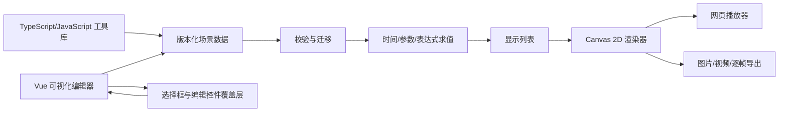

# 前端科普动画工具套件技术实现文档

> 版本：草案 v0.1（2026-09-30）
> 对应需求：[requirements.md](./requirements.md)
> 阶段：技术设计；本文是拟采用的实现方案，尚未创建工程或验证浏览器行为

## 1. 设计前提

首版同时提供 JavaScript/TypeScript 编程式工具库和浏览器可视化编辑器，以二维内容为主。交互预览和动画视频均按需求文档的 P0 范围实现。代码工具库、编辑器、播放器与导出器共用场景格式及时间求值逻辑。工程不依赖账户、数据库或远端渲染服务。

本设计把「双模式互通」限定在可序列化的共同能力内：对象、样式、坐标、参数、表达式和关键帧可以往返编辑；任意 JavaScript 回调仅在编程式运行环境中生效。编辑器导入时会明确拒绝无法序列化的回调；它不会尝试把代码自动还原成时间线。

## 2. 技术选型

| 部分 | 拟采用方案 | 原因与边界 |
| --- | --- | --- |
| 语言与工程 | TypeScript、包式单仓；工具库与编辑器分别构建 | 场景结构和公共接口需要类型约束；核心包不依赖 UI 框架。 |
| 编辑器 | Vue 3 + Vite | 适合构建画布外的属性面板、对象树和时间线；Vite 可分别构建浏览器应用与工具库。构建流程需单独运行 `vue-tsc`，不能把 Vite 转译当成类型检查。[Vue TypeScript 文档](https://vuejs.org/guide/typescript/overview)、[Vite 库模式](https://vite.dev/guide/build.html#library-mode)。 |
| 场景渲染 | Canvas 2D 为主，编辑器控制柄使用独立覆盖层 | Canvas 便于统一预览、图片和视频输出；覆盖层不进入最终作品。首版二维不引入三维渲染框架。 |
| 公式 | MathJax 的 SVG 输出，本地打包并缓存公式结果 | 公式 SVG 可以作为图像资源绘入 Canvas；独立 SVG 需正确配置字体缓存和样式。[MathJax SVG 输出](https://docs.mathjax.org/en/latest/output/svg.html)、[独立 SVG 说明](https://docs.mathjax.org/en/latest/web/convert.html)。 |
| 项目文件 | 带版本号的 JSON 场景数据；含图片等资产时打包为本地项目文件 | 代码和编辑器读写同一结构；项目可离线保存/打开，无需后端。 |
| 视频输出 | Canvas 流 + `MediaRecorder`；失败时输出逐帧图片 | 浏览器录制格式与编码能力不同，运行时检测，不能承诺统一 MP4。[Canvas captureStream](https://developer.mozilla.org/en-US/docs/Web/API/HTMLCanvasElement/captureStream)、[录制格式检测](https://developer.mozilla.org/en-US/docs/Web/API/MediaRecorder/isTypeSupported_static)。 |

依赖的精确版本、许可证与包体积在工程初始化时锁定并记录；本设计不依赖尚未安装的版本特性。

## 3. 总体架构



建议的目录边界如下。目录名是设计建议，具体包名在初始化工程时固定。

```text
apps/editor/             Vue 编辑器、模板入口、预览控制与帮助页面
packages/schema/         场景类型、运行时校验、版本迁移、项目文件读写
packages/engine/         表达式、参数、时间线、坐标、曲线采样、显示列表
packages/renderer-canvas/ Canvas 绘制、命中测试、文字/公式/图片资源缓存
packages/player/         播放/暂停/跳转/参数控制、页面挂载与销毁
packages/export/         PNG、浏览器视频录制、逐帧图片及能力检测
packages/sdk/            面向开发者的公开接口与类型声明
examples/                数学、物理、计算机三个共享场景示例
tests/                   模型、互通、渲染、编辑器和输出验证
```

`schema` 和 `engine` 不引用 Vue 或浏览器 DOM；`renderer-canvas` 不读取编辑器状态；`editor` 通过公开的项目操作和播放器接口工作。这样两个入口不会各自维护一套动画规则。

## 4. 场景数据与项目文件

### 4.1 核心结构

项目包含 `schemaVersion`、逻辑画布尺寸、场景列表和资产清单。每个场景包含时长、参数定义、对象树、动画轨道与扩展字段。对象至少有稳定 ID、类型、父级、层级、基础几何、样式和绑定关系；动画轨道通过「对象 ID + 属性路径」定位目标。

```ts
type Project = {
  schemaVersion: number;
  canvas: { width: number; height: number; fit: 'contain' | 'cover' };
  scenes: Scene[];
  assets: AssetRef[];
  extensions?: Record<string, unknown>;
};

type Scene = {
  id: string;
  duration: number; // 秒
  params: ParameterDef[];
  nodes: SceneNode[];
  tracks: AnimationTrack[];
};

type AnimationTrack = {
  target: { nodeId: string; property: string };
  keyframes: Array<{ time: number; value: unknown; easing?: string }>;
};
```

类型示例仅说明数据边界，不代表最终公开 API。公开项目格式使用 JSON Schema 或等效的运行时校验规则；导入时检查版本、ID 唯一性、父子循环、属性类型、关键帧顺序、参数范围和资源引用。未知主版本拒绝打开；已知旧版本通过显式迁移函数升级。命名空间化 `extensions` 作为不理解但可保留的数据，其内容不能直接执行。

编辑器默认保存为 `.cmanim` 项目包（ZIP 容器），包内为 `project.json` 和按内容哈希命名的 `assets/` 文件；无资产作品也允许单独保存 `project.json`。SDK 的项目读写接口同时接受这两种形式。JSON 中只保存资产 ID、媒体类型和引用，不保存机器本地路径。编辑器本地打开时先校验包和资源，再替换当前项目；校验失败保留当前编辑内容并报告具体字段。默认本地下载/文件选择，不依赖浏览器专有文件系统权限。

### 4.2 数值、表达式和扩展边界

可视化编辑器使用受限表达式语言描述连续变化：数字、四则运算、括号、常用数学函数、常量、参数引用与逻辑时间 `t`。表达式解析为 AST 后校验和求值，**不使用 `eval`、`new Function` 或直接执行导入文本**。首版限制表达式长度、AST 深度和每帧求值次数；不允许循环、赋值、任意函数调用或网络访问。语法与函数白名单在实现时列成独立用户文档。

同一对象属性同一时间只能有一个驱动来源：静态值、时间线轨道或表达式绑定。冲突在保存/预览前报错，不依靠隐含覆盖顺序。复杂编程逻辑可以通过 SDK 运行时扩展，但不能被序列化时应在生成项目数据时给出诊断；能序列化却无法被编辑器表达的扩展数据以只读信息展示并原样保留。

## 5. 时间、坐标与渲染管线

### 5.1 确定性时间模型

场景状态定义为 `State = evaluate(project, sceneId, validatedParams, t)`，其中 `t` 为以秒计的逻辑时间并被限制在 `[0, duration]`。播放器用实际时钟推进 `t`；暂停、倍速和拖动只改变传入的 `t`，不累积修改对象本身。直接跳到同一 `t` 与按顺序播放到该时刻必须得到同一对象状态和读数。

单次求值顺序固定为：校验参数 → 读取对象初始值 → 计算表达式/时间线 → 计算坐标与分组变换 → 生成有序显示列表 → 绘制。数值属性线性或按指定缓动插值，颜色按明确色彩空间插值，离散属性在关键帧边界切换；重复时间点和不支持的属性插值应被校验拒绝。动画并行由不同属性轨道表示，顺序由关键帧时间表示。随机性如需使用，必须由场景提供固定种子并成为 `evaluate` 的显式输入。

画布采用固定逻辑尺寸，通用对象坐标以左上为原点、`x` 向右、`y` 向下。数学坐标系对象负责把 `x` 向右、`y` 向上的数学坐标映射到画布；坐标范围和刻度不直接散落在组件中。容器缩放使用 `contain` 或 `cover` 策略，设备像素比只影响栅格清晰度，不改变逻辑坐标或时间状态。

### 5.2 对象和绘制

基础节点包括路径/线、箭头、圆、矩形、多边形、图片、文本、公式、坐标系、曲线和点。分组变换按「父级变换 → 自身平移 → 绕锚点旋转/缩放」计算；层级顺序由稳定的 `zIndex` 和对象原顺序决定。绘制前先生成显示列表，确保 Canvas 预览、静态图和录制都走相同的对象排序与样式计算。

编辑器命中测试使用显示列表中的对象 ID、边界与路径信息，并在独立覆盖层绘制选框、锚点和辅助线。导出只使用作品 Canvas，不包含编辑器辅助线。文本使用 Canvas 绘制并提供本地字体回退；跨浏览器字形可能不同，因此验收比较场景状态与同浏览器预览/导出的一致性，不要求跨平台像素完全相同。

公式输入限于首版公布的 TeX 语法和宏白名单。公式先异步转换为独立 SVG，配置独立字体缓存并清理不受支持的外部引用，再栅格化成可复用的图像缓存；缓存键包含公式文本、字体/颜色配置和输出尺寸。播放或导出前等待公式与图片资源就绪，失败则定位到相应对象。动态数值优先使用文本绑定，避免每帧重新排版公式。所有导入图片和生成的 SVG 都须满足 Canvas 的同源要求，否则图片与视频导出可能失败。[MathJax 独立 SVG 配置](https://docs.mathjax.org/en/latest/web/convert.html)、[Canvas 图片输出的同源约束](https://developer.mozilla.org/en-US/docs/Web/API/HTMLCanvasElement/toBlob)。

曲线由数学坐标系在指定定义域采样。采样器跳过非有限结果，并在极大跳变、指定断点或不连续区间处分段；对难以自动判断的函数，作者可以显式给出断点/定义域分段。采样设上限以避免输入函数拖垮预览，绘制器不连接被分开的段。

## 6. 两种创作入口

### 6.1 编程式工具库

SDK 提供场景构建器、参数与动画定义、项目读写，以及独立于编辑器的播放器控制。公开播放器最少支持 `mount`、`play`、`pause`、`seek`、`setParams`、`export` 和 `destroy`；`destroy` 释放计时器、监听器、对象 URL 和资源缓存引用。一个页面的多个播放器实例各有自己的时间与参数状态，不使用隐式全局单例。

构建器默认产生可序列化场景；需要自由 JavaScript 回调的扩展接口与可互通构建器分开。导出场景文件前报告不可序列化扩展，避免代码侧看似成功、编辑器侧无法打开。SDK 提供 TypeScript 声明，同时允许普通 JavaScript 项目使用。

### 6.2 可视化编辑器

编辑器由项目/场景列表、对象树、画布、属性面板、时间线、参数面板和预览/输出区组成。对象可通过画布或对象树选择；属性面板按节点类型显示可编辑字段；时间线按对象属性展示轨道和关键帧。键盘可通过对象树选择对象、通过属性面板改值，并完成播放、暂停、逐步、撤销和重做。

编辑器维护一个当前项目状态。所有修改通过可逆命令进入状态层，例如「添加节点」「修改属性」「移动关键帧」；同一次拖拽合并为一个撤销步骤。临时选中、悬停和面板开合只属于编辑器 UI 状态，不写入场景文件。每次提交命令后运行局部校验并更新播放器；严重结构错误阻止提交，公式/资源错误作为可定位诊断保留在界面。打开文件先在临时状态验证，成功后才替换项目。

三类示例均以共同场景格式保存。数学和物理示例使用参数与受限表达式驱动读数/位置；二分查找把每次比较与边界变化编排为可编辑的离散关键帧。纯代码版本可展示进一步扩展，但 P0 的共同部分必须能在编辑器内修改并保存。

## 7. 预览与导出

播放器、编辑器预览和导出器都调用同一个 `evaluate` 与 Canvas 渲染器。静态图在所选 `t` 渲染到目标尺寸的离屏画布，使用 `toBlob` 生成 PNG。逐帧输出按 `t_i = start + i / fps` 求值，并把 PNG 与帧序号/时间清单打包下载；它是浏览器不支持视频录制时的兜底，也是逐帧结果的确定性基准。

视频输出先探测 `captureStream`、`MediaRecorder` 和可录制 MIME 类型，再显示可选格式。录制时按真实时间从 `start` 播到 `end`，每帧仍从逻辑时间求值；录制结束后停止媒体轨道、释放资源并提供实际格式的文件。`MediaRecorder.isTypeSupported()` 只能表明格式预计可录制，资源不足仍可能失败，因此运行时错误应回退到逐帧输出。[MDN 格式能力说明](https://developer.mozilla.org/en-US/docs/Web/API/MediaRecorder/isTypeSupported_static)。

视频录制依赖实时调度，不能保证每台机器都取得逐帧 PNG 那样的固定帧数；默认建议输出 1280×720、30 fps，并在录制中报告进度、实际耗时与失败原因。首版不承诺统一 MP4、音轨或严格逐帧无丢帧视频。导出前应预加载公式、图片与字体；外部 URL 图片若未通过同源/CORS 检查，需提示改为导入本地资产。录制开始前可先做短片段预检，避免长时间任务完成后才发现格式不可用。

## 8. 性能、离线和风险控制

- 显示列表与资源按场景及版本缓存；参数或对象改变时只使相关缓存失效。曲线采样、公式转换和图片解码避免进入逐帧热路径。
- 表达式求值、曲线采样与项目导入设置工作量上限；长任务分片或移到 Worker，UI 保留取消入口。Worker 只计算数据，Canvas 绘制先保持单线程，以降低首版复杂度。
- 项目资源与公式依赖本地构建产物，断网后可通过本地静态服务使用；不要求直接双击 `file://` 文件运行。模板、字体和图片资源随应用或项目包提供。
- 不在首版浏览器编辑器中运行任意用户 JavaScript。若后续增加在线代码执行，必须先设计隔离执行环境及时间/内存限制，再满足需求文档 NFR-07。
- 项目包导入需限制大小、文件数量、解压后总量及路径；SVG 只接受内部公式渲染产物或经过清理的资产，不把导入的 HTML/SVG 作为可执行 DOM 插入页面。

## 9. 验证方案与需求追踪

| 验证层级 | 主要检查 | 对应需求 |
| --- | --- | --- |
| 纯函数与格式测试 | 场景校验/迁移、表达式边界、插值、坐标变换、曲线断点、同一时刻随机访问结果、项目包往返 | FR-01～FR-08、FR-15；NFR-01、NFR-02 |
| 工具库集成测试 | 代码构建场景、保存、编辑器加载、修改、重新由 SDK 加载；多播放器隔离与销毁 | FR-10、FR-13、FR-15 |
| 编辑器行为测试 | 无代码创建场景、对象和参数；关键帧拖动、撤销/重做、文件打开失败保留当前项目；键盘操作 | FR-11、FR-12、FR-14；NFR-05 |
| 浏览器输出测试 | 三类示例在 Chrome/Edge、Firefox、Safari 目标版本预览；PNG 与当前帧一致；视频可播放或明确回退为逐帧图片 | FR-03、FR-09；NFR-04、NFR-06 |
| 数值与性能测试 | 正弦值及切线、抛体位置/速度、二分查找边界独立断言；100 个简单对象连续 30 秒帧率与内存 | FR-04、FR-06、FR-11；NFR-02、NFR-03 |

NFR-03 的建议基准环境：1280×720 逻辑画布、设备像素比 1、100 个简单二维对象、30 秒连续播放；基准机为 Intel Core i5-1240P / 16 GB 内存或性能相当的设备，使用测试启动时的 Chrome 稳定版。平均帧率目标不低于 30 fps。验收报告必须记录设备、系统、浏览器准确版本、分辨率、帧率采样方法和结果；Firefox、Safari 另做功能兼容检查。若测试设备不同，先固定等效基准再比较，不把本机结果直接当成跨设备保证。

## 10. 实施顺序与待定项

1. **基础格式与引擎：**先建立场景校验、表达式、时间求值与 Canvas 显示列表，用三类最小场景验证确定性和数值正确性。
2. **工具库与编辑器：**提供 SDK 构建/播放器接口；编辑器依次接入对象树、属性面板、画布操作、时间线与本地项目读写，持续做双向往返测试。
3. **公式、资源与输出：**完成公式 SVG 缓存、资源预加载、PNG、逐帧输出、浏览器视频录制和降级提示。
4. **跨浏览器验收：**固定浏览器版本与基准机，完成三类示例、键盘操作、断网使用、性能与输出验证。

仍需在实现前收紧两项产品参数：单场景建议时长/资源大小上限，以及浏览器视频输出的优先格式。首版二维、交互与视频并重是当前设计依据；若产品重心变化，应同步更新需求和本设计，再拆解具体开发任务。
